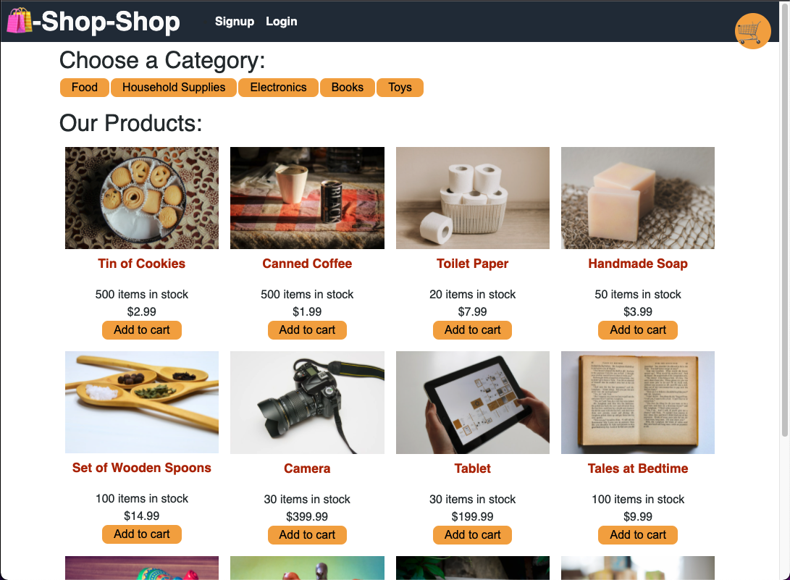

# REDUX REFACTOR

### About

This project was created to practice refactoring a React app using CONTEXT API to Redux.

The instruction was minimal to encourage proficiency in navigating and understanding documentation.

The documentation for Redux can be found at <https://redux.js.org/introduction/getting-started>

## Table of Contents

- [Deployed Application](#deployed-application)
- [Usage](#usage)
- [License](#license)
- [Available-Scripts](#available-scripts)
- [Learn-More](#learn-more)
- [Contributing](#contributing)
- [Questions](#questions)

## Deployed Application

## Usage

🛍️-Shop-Shop is a resposive web app that allows you to create a user, login, and peruse a fictious shop. You can browse by category and place items into your cart.
